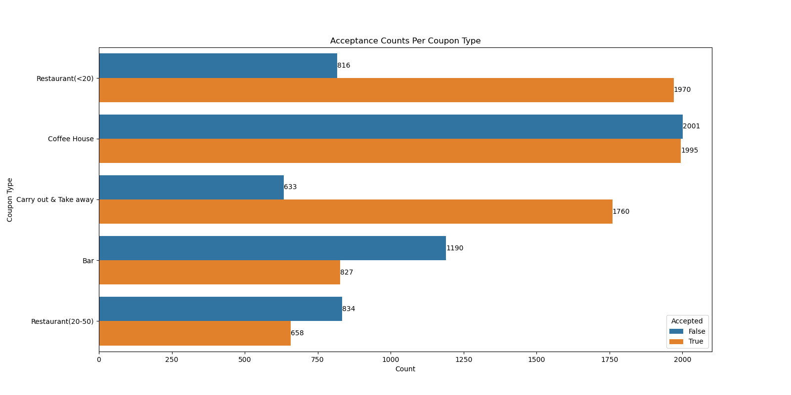
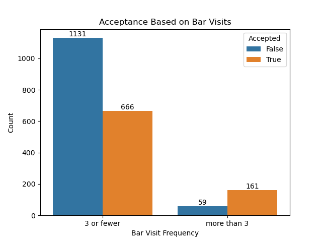
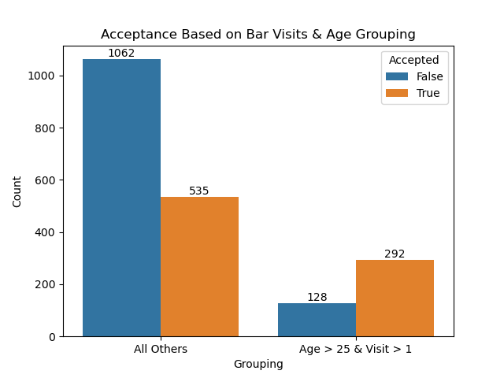
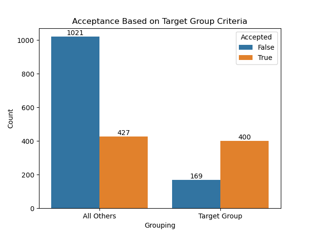
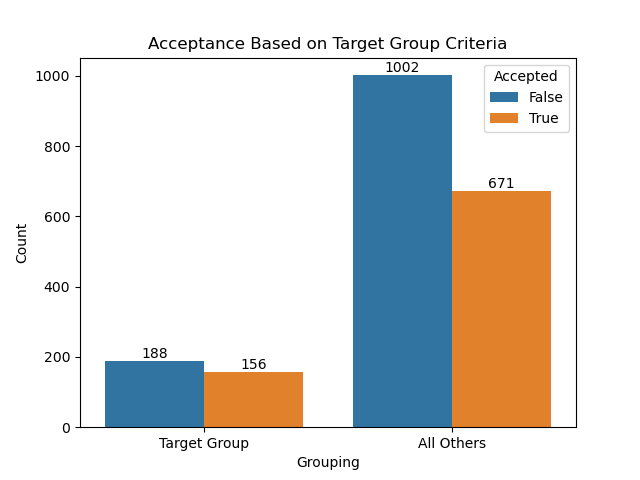
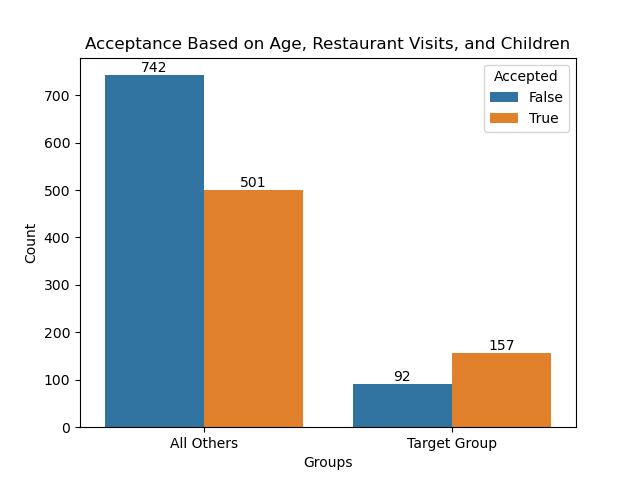
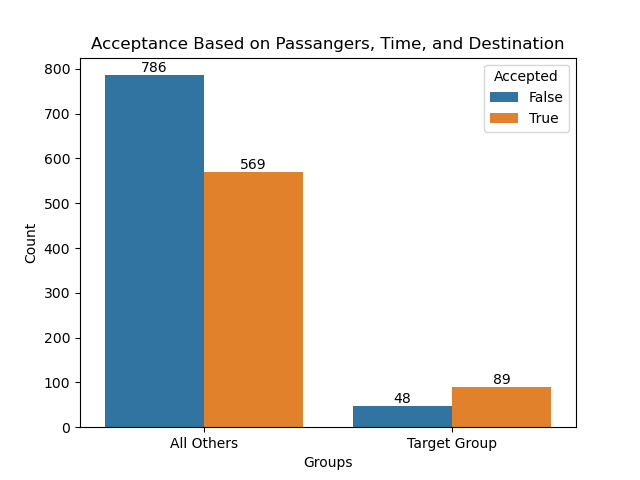
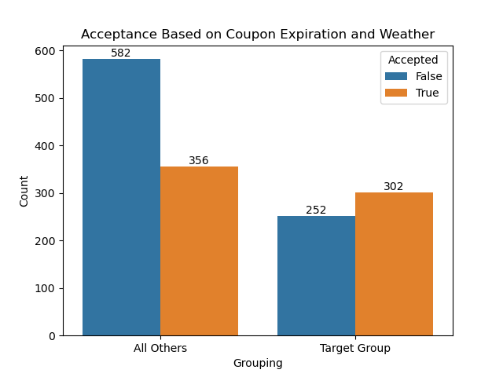

# Coupon Analysis

# Context
Imagine driving through town and a coupon is delivered to your cell phone for a restaraunt near where you are driving. Would you accept that coupon and take a short detour to the restaraunt? Would you accept the coupon but use it on a sunbsequent trip? Would you ignore the coupon entirely? What if the coupon was for a bar instead of a restaraunt? What about a coffee house? Would you accept a bar coupon with a minor passenger in the car? What about if it was just you and your partner in the car? Would weather impact the rate of acceptance? What about the time of day?
Obviously, proximity to the business is a factor on whether the coupon is delivered to the driver or not, but what are the factors that determine whether a driver accepts the coupon once it is delivered to them? How would you determine whether a driver is likely to accept a coupon?

# Objective
Explore one of the other coupon groups and try to determine the characteristics of passengers who accept the coupons.

# Analysis

## Overview of All Coupon Acceptance Rates

| Coupon                |   False  |    True  |      Sum | Acceptance Rate |
|-----------------------|---------:|---------:|---------:|----------------:|
| Bar                   | 0.093819 | 0.065200 | 0.159019 |        0.410015 |
| Restaurant(20-50)     | 0.065752 | 0.051876 | 0.117629 |        0.441019 |
| Coffee House          | 0.157758 | 0.157285 | 0.315043 |        0.499249 |
| Restaurant(<20)       | 0.064333 | 0.155314 | 0.219647 |        0.707107 |
| Carry out & Take away | 0.049905 | 0.138757 | 0.188663 |        0.735478 |

From the data above, the coupon with the largest acceptance rate was the "Carry out & Take away" coupon with ~73% acceptance rate. The Bar coupon was the lowest with 41% acceptance rate. Lets look into the lowest accepted coupons and see if we can identify the target groups for each.

### Bar Coupon Target Groups

Having processed the dataset below are some target groups found for the Bar Coupon.

#### Target Group 1: 
- visit the bar more than 3 times a month

| bar_visits  | False | True | Sum  | Acceptance Rate |
|-------------|-------|------|------|-----------------|
| 3 or fewer  | 1131  | 666  | 1797 | 0.370618        |
| more than 3 | 59    | 161  | 220  | 0.731818        |

Among those that visit the bar more than 3 times a month, the acceptance rate was 73.18%, which is 32.19% higher than the overall acceptance rate of 41.00%, indicating that this would be a good group to target in future coupon campaigns. Furthermore, a z-test on the data yielded a p-value of 8.5305e-25, which, being less than 0.05, indicates that this difference is statistically significant.

#### Target Group 2: 
- visit the bar more than once a month AND 
- are over the age of 25

| Group     |   False  |   True  |    Sum  | Acceptance Rate |
|----------------------|---------:|--------:|--------:|----------------:|
| Age > 25 & Visit > 1 |      128 |     292 |     420 |        0.695238 |
| All Others           |     1062 |     535 |    1597 |        0.335003 |

Among those that visit the bar more than once a month AND are over the age of 25, the acceptance rate was 69.52%, which is 28.52% higher than the overall acceptance rate of 41.00%, indicating that this would be a more granular group to target in future coupon campaigns. Furthermore, a z-test on the data yielded a p-value of 1.08683e-40, which, being less than 0.05, indicates that this difference is statistically significant.

#### Target Group 3

 - go to bars more than once a month AND
 - had passengers that were not a kid AND
 - had occupations other than farming, fishing, or forestry

| Group | False | True | Sum | Acceptance Rate |
|--------------------------|-------|------|-----|-----------------|
| All Others | 1021 | 427 | 1448 | 0.294890 |
| Target Group | 169 | 400 | 569 | 0.702988 |

Among those that go to bars more than once a month AND had passengers that were not a kid AND had occupations other than farming, fishing, or forestry, the acceptance rate was 70.29%, which is 29.29% higher than the overall acceptance rate of 41.00%, indicating that this would be a even more granular group to target in future coupon campaigns. Furthermore, a z-test on the data yielded a p-value of 4.048403e-63, which, being less than 0.05, indicates that this difference is statistically significant.

#### Target Group 4
- Visit bars more than once a month, travel with passengers other than children, and are not widowed,
- Visit bars more than once a month and are under the age of 30, or
- Frequent inexpensive restaurants more than 4 times a month with an income of less than $50K,

| Group   | False | True | Sum  | Acceptance Rate |
|---------------|-------|------|------|-----------------|
| All Others    | 1002  | 671  | 1673 | 0.401076        |
| Target Group  | 188   | 156  | 344  | 0.453488        |

The coupon acceptance rate was 45.34%. This rate is a modest increase of only 4.34% compared to the overall acceptance rate of 41.00%. A z-test on this data gave a p-value of 0.0718. Since this value is greater than 0.05, the observed difference is not statistically significant. Hence, targeting this particular group is not recommended.

### Restaurant (20 - 50) Coupon

Having processed the dataset below are some target groups found for the Restaurant (20 - 50) Coupon.

#### Target Group 1

 - Does not have children AND
 - Age is between 21 and 50 AND
 - Visits restaurant between 1 and 8+ times a month

| TargetGroup   | False | True | Sum  | Acceptance Rate |
|---------------|-------|------|------|-----------------|
| All Others    | 742   | 501  | 1243 | 0.403057        |
| Target Group  | 92    | 157  | 249  | 0.630522        |

Among those that do not have children, and are between the ages of 21 and 50, and visit the restaurant between 1 and 8+ times a month, the acceptance rate was 63.05%, which is 19.05% higher than the overall acceptance rate of 44%, indicating that this would be a good group to target in future coupon campaigns. Furthermore, given that the p-value of 4.15637-11 is less than 0.05, this difference can be considered statistically significant.

#### Target Group 2

 - Has a partner as a passanger AND
 - Receives the coupon between 10AM dn 6PM AND
 - Has no urgent destination

| TargetGroup   | False | True | Sum  | Acceptance Rate |
|---------------|-------|------|------|-----------------|
| All Others    | 786   | 569  | 1355 | 0.419926        |
| Target Group  | 48    | 89   | 137  | 0.649635        |

 Among those that travel with a partner, and are traveling between the hours of 10AM and 6PM, and have no urgent destination, the acceptance rate was 64.96%, which is 20.96% higher than the overall acceptance rate of 44%, indicating that this would be a good group to target in future coupon campaigns. Furthermore, given that the p-value of 2.462240e-07 is less than 0.05, this difference can be considered statistically significant.

 #### Target Group 3
- Coupon expiration is 1 day AND
- Weather is Sunny and 80 Deg

| TargetGroup   | False | True | Sum | Acceptance Rate |
|---------------|-------|------|-----|-----------------|
| All Others    | 582   | 356  | 938 | 0.379531        |
| Target Group  | 252   | 302  | 554 | 0.545126        |

Among those that are are sent a coupon on a Sunny day with a temperature of 80 deg and a coupon expiration of 1 day, the acceptance rate was 54.51%, which is 10.51% higher than the overall acceptance rate of 44%, indicating that this would be a good group to target in future coupon campaigns. Furthermore, given that the p-value of 4.83596e-10 is less than 0.05, this difference can be considered statistically significant.

## Conclusion

### Bar Coupon Target Groups

Analysis of the Bar coupon acceptance rate revealed several specific groups with significantly higher rates than the overall acceptance of 41%. Specifically the following:

- Individuals that visit bars more than 3 times a month have an acceptance rate of 73.18%. This is 32.19% higher than the overall bar coupon rate, making them a prime group to target in future campaigns.
- Individuals that are 25+ and visit bars at least once a month have an acceptance rate of 69.52%. This is 28.52% higher than the overall bar coupon rate, making them a prime group to target in future campaigns.
- Individuals that visit bars at least once a month, do not have kids and are not in an AGG type of job have an acceptance rate of 70.29%. This is 29.29% higher than the overall bar coupon rate, making them a prime group to target in future campaigns.

Targeting these groups in future campaigns should yield a higher overall acceptance rate for the Bar coupon.

Additionally, targeting 
- Individuals that visit bars more than once a month, travel with passengers other than children, and are not widowed OR
- Individuals that visit bars more than once a month and are under the age of 30, OR
- Individuals that frequent inexpensive restaurants more than 4 times a month with an income of less than $50K,

have an acceptance rate was 45.34%. This rate is a modest increase of only 4.34% compared to the overall acceptance rate of 41.00%. A z-test on this data gave a p-value of 0.0718. Since this value is greater than 0.05, the observed difference is not statistically significant. Hence, targeting this particular group is not recommended.

### Restaurant (20 - 50) Coupon Target Groups

Analysis of the Restuarant (20 - 50) coupon acceptance rate revealed several specific groups with significantly higher rates than the overall acceptance of 44%. Specifically the following:
- Individuals aged between 21 and 50, who do not have children and frequent the restaurant between 1 and 8+ times a month, have an acceptance rate of 63.05%. This is 19.05% higher than the overall rate, making them a prime group to target in future campaigns.
- People traveling with a partner between 10AM and 6PM, with no pressing destination, show a 64.96% acceptance rate, a 20.96% increase over the general trend. They also represent a promising target demographic for future coupon promotions.
- On sunny days with temperatures of 80°F, offering coupons with a one-day expiration can be effective. The observed acceptance rate for such conditions is 54.51%, which is 10.51% higher than the overall rate.

For all the above scenarios, the observed differences in acceptance rates are statistically significant with p-values less than 0.05. Thus, future coupon campaigns should strongly consider these findings to maximize their effectiveness.